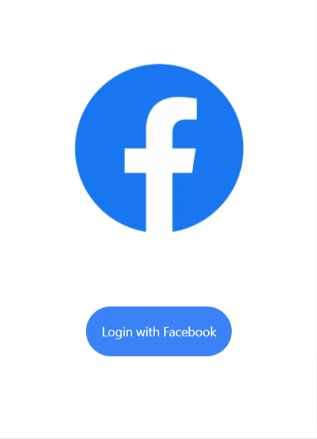

# facebook-clone
BELOW IS THE LINK TO APP

https://whatsapp-simple-clone.herokuapp.com/


## React Portfolio

- [Description](#Description)
- [Installations](#Installations)
- [Contributing](#Contributing)
- [Test](#Test)
- [Credits](#Credits)
- [Questions](#Questions)

## Description

This app is for education purpose, it is only build to showcase the ability of the developer to match the styling of facebook page.
## Installations

* Clone and `npm i`
* Set your .env.local file with the following configuration found on facebook project and firebase projects
    *   ```FACEBOOK_CLIENT_ID=""
            FACEBOOK_CLIENT_SECRET=""
            NEXTAUTH_URL=http://localhost:3000/
            FIREBASE_API_KEY=""
            AUTH_DOMAIN=""
            PROJECT_ID=""
            STORAGE_BUCKET=""
            MESSAGING_SENDER_ID=""
            APP_ID=""```
## Contributing

none at this time

## Test

[](https://feisbuc-clone.herokuapp.com/)

[live link](https://feisbuc-clone.herokuapp.com/)

## Questions
email, or any other form of contact at my portfolio
<br>
-Email: [danielsoledad@gmail.com](mailto:danielsoledad@gmail.com)
<br>
-GitHub Username: [tuzosdaniel12](https://github.com/tuzosdaniel12) 
<br>
-Portfolio: [daniel-soledad.dev](https://daniel-soledad.dev) 


